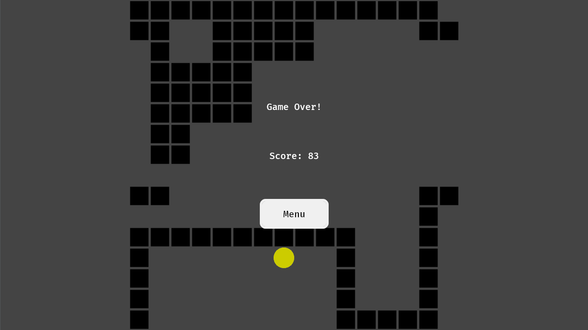

# Snake Game with Bevy

A classic Snake game implemented using the [Bevy](https://bevyengine.org/) game engine in Rust.

It doesn't follow any tutorial in particular, rather my own (little) experience with Bevy.

## Features

- Classic Snake gameplay
- [ELM](https://guide.elm-lang.org/architecture) style UI with theme support
- Modular architecture

Menu | Gameplay | Game Over
:-------------------------:|:-------------------------:|:-------------------------:
 |  | 


## Installation

1. Install Rust via [rustup](https://rustup.rs/)
2. ```bash
   git clone https://github.com/hocop/snake_bevy
   cd snake_bevy
   ```
3. ```bash
   cargo run
   ```

## Controls

- **Arrow Keys** - Move the snake
- **Escape** - Menu
- **Q** - quit game

## Dependencies

- [Bevy](https://github.com/bevyengine/bevy) - Game engine
- [Leafwing Input Manager](https://github.com/Leafwing-Studios/leafwing-input-manager) - Input handling
- [Serde](https://github.com/serde-rs/serde) - Serialization
- [Rand](https://github.com/rust-random/rand) - Random number generation

## License

This project is licensed under the MIT License - see the LICENSE file for details.
